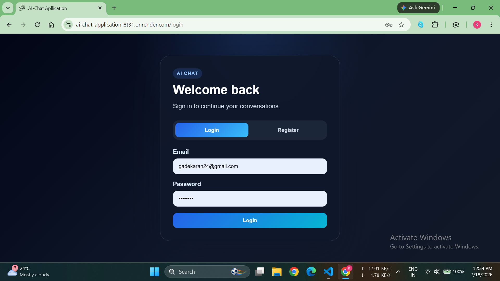
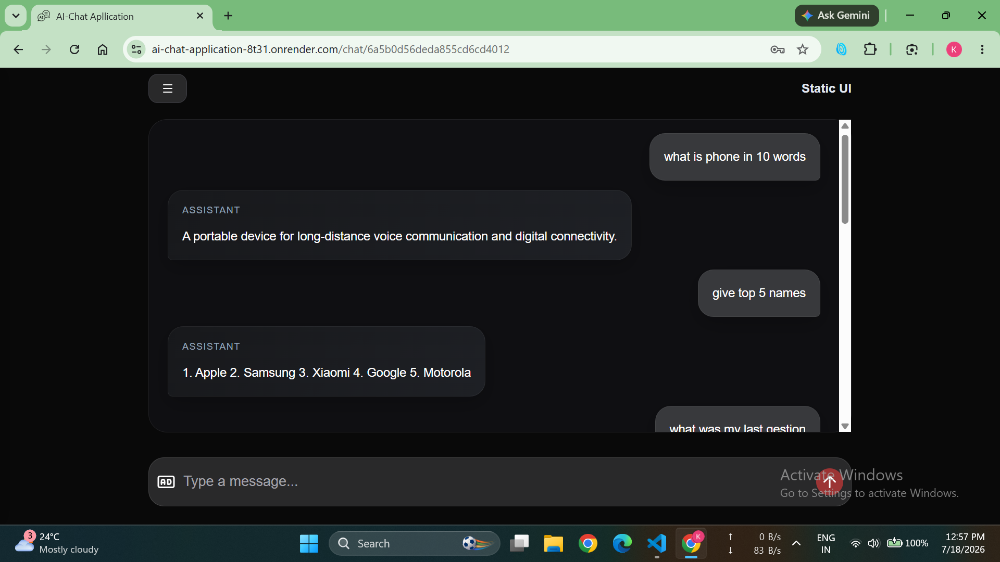
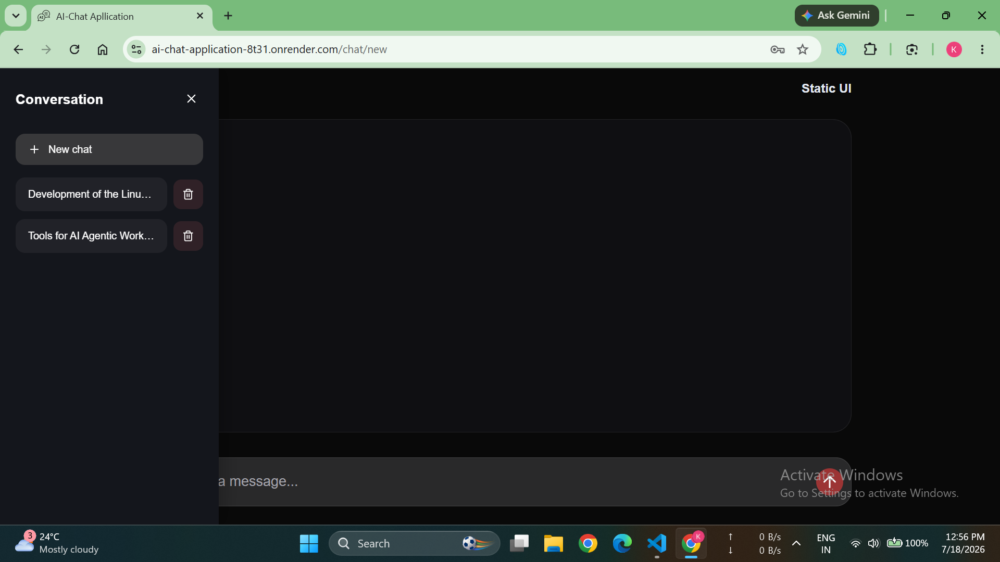

# AI Chat Application

A full-stack AI chat application built with React, Vite, Node.js, Express, MongoDB, and Google Gemini AI. Users can register or log in, start new conversations, continue saved chats, and receive streaming AI responses in a modern chat UI.

## Live Demo

- Live app: https://ai-chat-application-8t31.onrender.com/
- GitHub repository: https://github.com/KaranGade24/AI-chat-application

## Screenshots







## Features

- Secure user authentication with email/password registration and login
- JWT-based session handling with cookies
- Create new chats and continue previous conversations
- Save and retrieve chat history from MongoDB
- Delete old conversations from the sidebar
- Streaming AI responses powered by Gemini
- Responsive chat interface with sidebar navigation

## Tech Stack

### Frontend

- React
- Vite
- React Router DOM
- Lucide React icons

### Backend

- Node.js
- Express.js
- MongoDB + Mongoose
- JWT + cookie-parser
- CORS
- dotenv

### AI Integration

- Google Gemini API

## Project Structure

- backend/: Express server, routes, controllers, middleware, MongoDB models
- frontend/: React + Vite client app
- images/: screenshots used for documentation

## Installation

### Prerequisites

- Node.js (v18 or newer)
- npm
- MongoDB instance
- Google Gemini API key

### 1) Clone the repository

```bash
git clone https://github.com/KaranGade24/AI-chat-application.git
cd AI-chat-application
```

### 2) Install dependencies

```bash
cd backend
npm install

cd ../frontend
npm install
```

### 3) Configure environment variables

Create a `.env` file inside the backend folder with:

```env
GOOGLE_API_KEY=your_google_gemini_api_key
MONGODB_URI=your_mongodb_connection_string
JWT_SECRET=your_jwt_secret
```

### 4) Run the app locally

Start the backend:

```bash
cd backend
npm run dev
```

Start the frontend:

```bash
cd frontend
npm run dev
```

Then open:

```text
http://localhost:5173
```

## Usage

1. Open the app and create an account or log in.
2. Start a new chat from the sidebar.
3. Type a question and receive a streamed AI response.
4. Open previous conversations from the sidebar to continue them.

## Notes

- The backend also serves the frontend build in production.
- The deployed version is available at the live demo link above.
